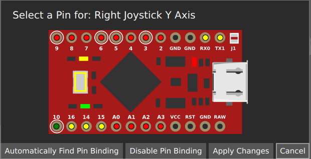

# Building a Directly Wired Controller
## You will need
* One of the following Arduinos:
  * Arduino Pro Micro (3.3v)
  * Arduino Pro Micro (5v)
  * Arduino Leonardo
  * Arduino Micro
  * Arduino Uno
  * Arduino Mega
* Some sort of tilt sensor (if you want tilt) out of the following list:
  * A basic tilt switch (sometimes called a Mercury or Gravity switch). It is recommended to use two, as this can help avoid accidental activations (this is what is done in some offical guitars)
  * [MPU 6050](https://invensense.tdk.com/products/motion-tracking/6-axis/mpu-6050/)
  * An analogue accelerometer, such as the [ADXL3xx](https://www.arduino.cc/en/Tutorial/ADXL3xx)
* Some Wire
* A Soldering Iron
* A multimeter
* Wire Strippers
* Wire Cutters
* Heatshrink

## The finished product


```danger
Avoid pins 0 and 1 on the Arduino UNO, as these get used for sending controller information over USB. 
```

```danger
Be careful when programming an Arduino that has multiple variants. If you pick the wrong voltage, your device won't show up and you will need to follow the [rescuing](https://sanjay900.github.io/guitar-configurator/tool/rescuing.html) instructions to make it show up again!
```

```danger
If you want to add LEDs to your guitar, avoid the MISO, MOSI and SCK pins on your Arduino.
   * For an Arduino Pro Micro (3.3v), Leonardo or Micro, the SCK pin is pin 15, the MOSI pin is pin 16 and the MISO pin is pin 14.
   * For an Arduino Uno, pin 11 is MOSI, pin 12 is MISO and pin 13 is SCK.
```

```note
Besides the above, it doesn't matter which pins you choose when wiring up your guitar, as the Config Tool will be configured later with the pins you use.
```

## Steps
1. Put your multimeter into continuity mode (it should beep when both contacts are shorted together)
2. Work out the pinout of the various componenents in your guitar, and cut the wires as close to the PCB as you can, giving yourself the most amount of wire that you can get. You may find however that the wire isn't long enough, in this case you can either join some more wire onto the end of the existing wires, or you can desolder the cables and replace them.
   1. On some guitars, if you are lucky the pinout will be written on the various original pcbs and you can use this to work out what each wire does
   2. Otherwise, you will have to manually work out what the fret pins are. Cut the wires coming from the neck close to the original PCB, and then use the multimeter to work out what wire is which. Its easiest to open up the neck, and follow the traces between the fret contacts. A ground wire will have several fret traces leading to it, while a fret wire will lead to a single fret. At the end of this guide, there are some images for known neck pinouts. When using the multimeter, test between the fret wire and the ground wire, and the multimeter should beep when the fret is pressed.
   3. With the whammy, the middle pin is the data pin, and one outer pin pins is VCC while the other pin is GND (it doesn't matter which one, you can flip it when programming later if needed). Whammy needs to go to an analogue pin (one of the A) pins
   4. The start and select buttons should be easy to work out, usually they use three wires, a common ground and a wire to each button. The multimeter can help you confirm if you have the wires correct, as it will beep when you hit a button and have the correct wires.
   5. The Strum switches are similar to the start and select buttons, they will be three wires on some guitars. On others, the Strum switches are a part of the main PCB, and you will need to solder directly to the strum switches, which should poke out the back of the main PCB. For example, on a wiitar, you will see the following: 
   
   In this case, there are two grounds that will be shorted together, so with the multimeter, you should be able to work out which pins are ground, by testing a pin from each switch, and working out which ones are shorted together by it beeping.
   Note that you can also choose to replace the original PCB with a 3D printed strum switch holder. If you want to go that route, there are some designs around for various guitars. The image above shows how this would look.
   6. For guitars with a DPad, there will again be a similar situation strum switches, there will be a single common ground and a pin for each direction.
   7. For guitars with a joystick, there will be four pins, one is VCC, one is GND, one is the x axis and one is the y axis. You can work out which is which by tracing the traces, however on some guitars the traces are labelled for you. The joystick needs to go to an analogue pin (one of the A pins)
10. Connect your tilt sensor
    * If you are using a basic tilt switch, connect two switches in series between ground and any digital pin that has not already been used.
    * If you are using a MPU 6050, connect its SCL and SDA pins to the same pins as above. Also connect its GND pin to GND on your arduino and its VCC pin to VCC on your arduino. 
    * If you are using an analogue tilt sensor, hook the x y and z pins up to any of the analogue pins on your Arduino. Note that when using an Arduino uno, you cannot use pins A4 or A5.
4. Connect the Joystick
   1. Connect VCC and GND
   2. Connect the X Axis to an analogue pin. These are labeled with an A on the Arduino. 
   3. Connect the Y Axis to a different analogue pin.
5. Connect the Whammy
   1. Connet VCC and GND
   2. Connect the data (middle) pin to an analogue pin on the Arduino. These are labeled with an A on the Arduino.
6. Connect the frets
   1. Connect the common grounds to a ground pin on the Arduino
   2. Connect each fret to its own unused digital or analogue pin (if you are running out of pins).
9.  Connect Start + Select
    1.  Connect the common ground to a GND on the Arduino
    2.  Connect each button to an unused digital or analogue pin on the Arduino
10. Connect Strum
    1.  Connect the common ground to a GND on the Arduino
    2.  Connect each strum switch to an unused digital or analogue pin on the Arduino
11. Start the Ardwiino Configuration Tool
12. Plug in your Arduino
13. Your Arduino should show up, like in the following image.

    

14. Click Continue
15. You will be met with the following screen (Note that it will be slightly different for an Arduino Uno or Arduino Mega)

    

16. For the Micro, Leonardo and Pro Micro, please pick the type of device you have in the dropdown. Note that you need to get the voltage right, otherwise your device will not work and will need to be reset.
17. Click `Start programming` and wait for it to program
18. Once it finishes, Click `Start Configuring`
19. You will be taken to following the configuration screen.

    

20. Click on `Change Device Settings`.
21. You will be shown the following dialog:

    

22. Change `Controller Connectivity Type` to Direct.
17. You can also change the `Controller Output Type` here too if you would like to emulate a different type of controller, such as a drum set, a standard controller or even a controller for a different console, like a PS3 or a Switch.
23. If you would like the Left Joystick (The only Joystick on a Wii Guitar) to act like the DPad, then enable `Map Left Joystick to DPad`
24. If you would like to emulate the Home button by hitting both Start and Select at the same time, then enable `Map Start + Select to Home`
25. Hit Close
26. If you want to enable Tilt, click on Configure Tilt
    1.  The following dialog will appear
      
        

    2.  Set the Tilt Sensor Type
        * Use Digital for a Basic Tilt Switch
        * Use MPU 6050 for a MPU 6050
        * Use Analogue for an Analogue Tilt Switch
    3. For a MPU 6050, you can just hit Close, for other tilt sensors the following instructions are needed.
    4. Click on the button underneath Pin Binding.
    5. The Pin Configuration Dialog will appear:

       

    6. You can either click on the pin that you have plugged your tilt into, or use the `Automatically Find Pin Binding` button. You can then just tilt the guitar to activate tilt. Note that for analogue tilt sensors, you just need to pick the pin for the axis of tilt you want to activate your guitar. This will depend on how you have mounted your tilt sensor.
    7. Click `Apply Changes`
    8. Click `Close`
 1. You should now be back at the main screen. You have two options for configuring pins, list view and graphical view, you are currently in graphical view.
    1. If you want to use graphical view (its easier to use but slower)
       1. From here, you can hover over buttons to configure them. You will be presented with the folowing dialog:
            
       2. Click on 'Change Pin Binding' button. You will then be presented with the pin configuration dialog
       3. You can either click on the pin that you have plugged the input you are configuring into, or use the `Automatically Find Pin Binding` button. You can then just press the button you are configuring or for whammy or joystick, just move the whammy or joystick. 
    2. If you want to use list view, click the list view icon at the top right of the screen:
       
       1. In list view, you are just presented with a list of all of the possible bindings. You can just click on the `Pin Binding` button for each input you want to bind, and you will be taken directly to the pin configuration dialog.
       2. You can either click on the pin that you have plugged the input you are configuring into, or use the `Automatically Find Pin Binding` button. You can then just press the button you are configuring or for whammy or joystick, just move the whammy or joystick. 
 2. Click `Write`
 3. At this point, your controller should be working, test it using the Windows controller tester or a game controller tester of your choice.