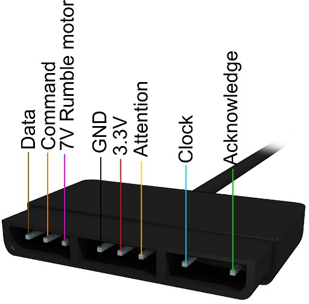

# Building an Adaptor for a PS2 Controller
## You will need
* One of the following Arduinos:
  * Arduino Pro Micro (3.3v)
  * With the following devices, you will need the following level shifter: https://learn.sparkfun.com/tutorials/bi-directional-logic-level-converter-hookup-guide/all
    * Arduino Leonardo
    * Arduino Micro
    * Arduino Uno
    * Arduino Mega
    * You can also use a 5v Pro Micro, but you will need to also get a 3.3v voltage regulator
* PS2 Controller socket or some male dupont wires
* Some Wire
* A Soldering Iron

```danger
Be careful that you don't ever provide 5v power to any pins on the PS2 Controller. While some people have done this successfully and just use their controllers with 5v, I can't recommend this approach as the controllers are really designed for 3.3v, so it may damage them slowly over time.
```

```danger
Be careful when programming an Arduino that has multiple variants. If you pick the wrong voltage, your device won't show up and you will need to follow the [rescuing](https://sanjay900.github.io/guitar-configurator/tool/rescuing.html) instructions to make it show up again!
```

## The finished product (When using a 3.3v Pro Micro and dupont wires)


## Steps
Refer to the following image for the pinout of a PS2 controller.



1. Connect Attention to pin 10. Note that for anything that isn't the 3.3v pro micro, you will need to connect this pin using a level shifter.
2. Connect Command to MOSI, Data to MISO and Clock to SCK. Note that for anything that isn't the 3.3v pro micro, you will need to connect these pins using a level shifter.
   * For an Arduino Pro Micro (3.3v), Leonardo or Micro, the SCK pin is pin 15, the MOSI pin is pin 16 and the MISO pin is pin 14.
   * For an Arduino Uno, pin 11 is MOSI, pin 12 is MISO and pin 13 is SCK.
2. Connect the 3.3v pin on the ps2 controller to the 3.3v pin on your Arduino. For all devices except the 3.3v Pro Micro, you will need to hook a 3.3v voltage regulator to the Arduino first, and then connect the 3.3v output of the regulator to the ps2 controller's 3.3v pin.
3. Connect the gnd pin on the wii breakout / extension cable to the gnd on your Arduino.
1. Start the Ardwiino Configuration Tool
2. Plug in your Arduino
3. Your Arduino should show up, like in the following image.

    

4. Click Continue
5. You will be met with the following screen (Note that it will be slightly different for an Arduino Uno or Arduino Mega)

    

6. For the Micro, Leonardo and Pro Micro, please pick the type of device you have in the dropdown. Note that you need to get the voltage right, otherwise your device will not work and will need to be reset.
7. Click `Start programming` and wait for it to program
8. Once it finishes, Click `Start Configuring`
9.  You will be taken to following the configuration screen.

    

10. Click on `Change Device Settings`.
11. You will be shown the following dialog:

    

12. Change `Controller Connectivity Type` to PS2.
1.  You can also change the `Controller Output Type` here too if you would like to emulate a different type of controller, such as a drum set, a standard controller or even a controller for a different console, like a PS3 or a Switch.
13. If you would like the Left Joystick (The only Joystick on a Wii Guitar) to act like the DPad, then enable `Map Left Joystick to DPad`
14. If you would like to emulate the Home button by hitting both Start and Select at the same time, then enable `Map Start + Select to Home`
15. Hit Close
16. Click `Write`
17. At this point, your controller should be working, test it using the Windows controller tester or a game controller tester of your choice.