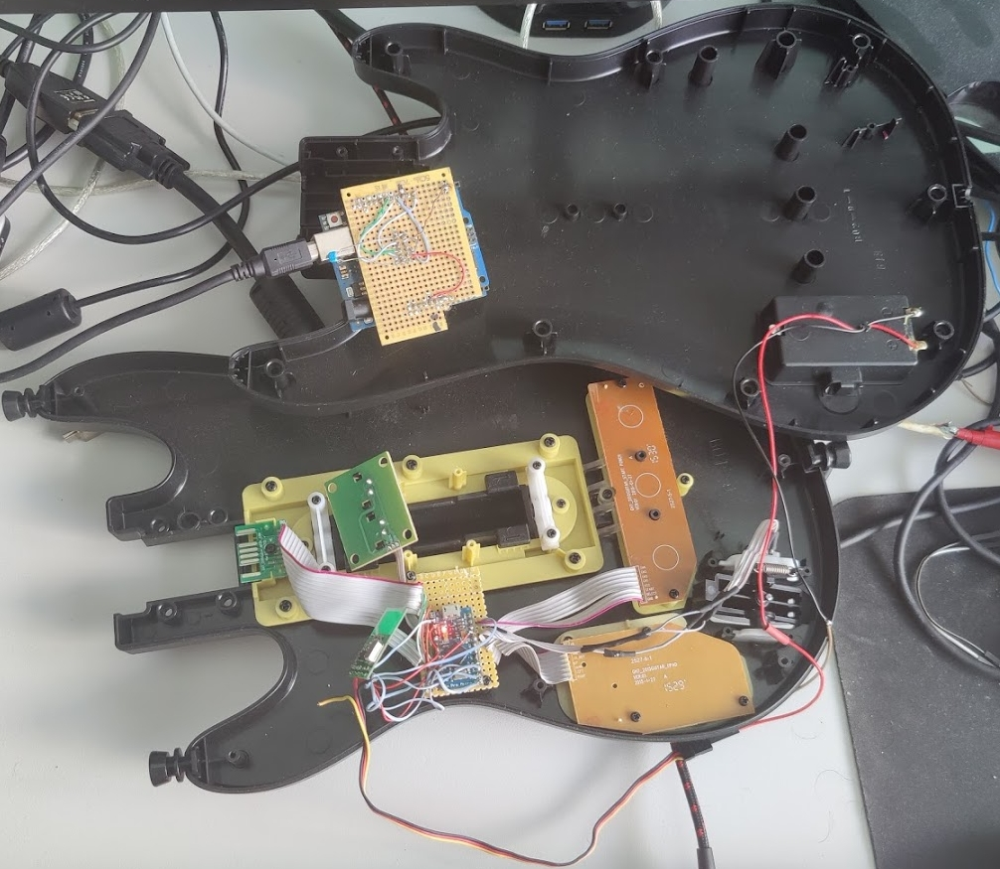

# Building a RF (Wireless) Guitar and Receiver
## You will need
* Two NRF24l01s
* The parts to build either a wii adaptor or directly wired guitar from their respective guides.
  * For the Arduino, an Arduino Pro Mini is recommended for the arduino that is used as a transmitter, as these use very small amounts of power compared to other arduinos
  * If using an Arduino Pro Mini, you will also need an FTDI breakout for it
  * You will also need batteries for this arduino
* Another arduino to use as a receiver, this can be one of the following:
  * Arduino Pro Micro (3.3v)
  * Arduino Pro Micro (5v)
  * Arduino Leonardo
  * Arduino Micro
  * Arduino Uno
  * Arduino Mega
* Some Wire
* A Soldering Iron
* A multimeter
* Wire Strippers
* Wire Cutters
* Heat shrink

```note
RF transmitting Arduinos (the side that connects to the controller) are programmed to go to sleep after 10 minutes, and then will need to be woken up by their respective wakeup pins, which will be explained later in the guide.
```

```danger
PS2 Guitars and RGB leds are incompatible with RF, as they all use the same pins.
```

## The finished product


## Steps
1. Connect the VCC and GND pins on each RF module to its respective Arduino.
2. Connect the SCK on the Arduino to SCK on the nrf24l01, CE to CE, MOSI to MO, MISO to MI, pin 10 to CSN and IRQ to IRQ
   * For an Arduino Pro Micro, Leonardo or Micro, the SCK pin is pin 15, the MOSI pin is pin 16, the MISO pin is pin 14, CE is pin 0 and IRQ is pin 1.
   * For an Arduino Uno, pin 11 is MOSI, pin 12 is MISO, pin 13 is SCK, CE is pin 8 and IRQ is pin 2.
   * For an Arduino Mega, the SCK pin is 52, the MOSI pin is pin 51, the MISO pin is 50, the CE pin is pin 53, and the IRQ pin is pin 2.
3. Hook a button up to the following pin on your transmitting arduino, this is used for waking up the device from sleep, and can be an existing button. For example, you could wire your start button here and use it to wake the arduino up from sleep.
   * For an Arduino Pro Micro the wake up pin is 7
4. Follow the guide of your choice to hook up the controller inputs to the transmitter arduino
   * [Direct](direct.md)
   * [Wii](wii.md)
   * For an Arduino Uno, Mega or Pro Mini, the wake up pin is pin 3
5. Plug in the receiver arduino, open the config tool and program it.
6. Hit the Configure RF button, and then enable RF
7. Click on Program RF Transmitter
8. Plug in your transmitting arduino
9.  Program the transmitting arduino
10. Configure the guitar, this is detailed better in the guide specific to the type of guitar your creating
   * [Direct](direct.md)
   * [Wii](wii.md)