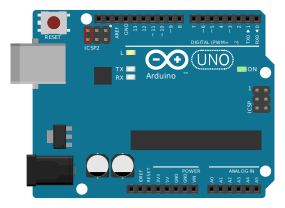

# Rescuing a device that no longer shows up in windows
The tool has the ability to detect devices in firmware update mode, and offer to fix them back up. For all supported arduinos except the Uno, you can just short reset to GND twice to get to this mode, and it will stay in firmware update mode for a few seconds, so as long as the config tool is open this should be enough time to reprogram the device. For the Arduino Uno, you need to short the following reset pins to get into firmware update mode:

